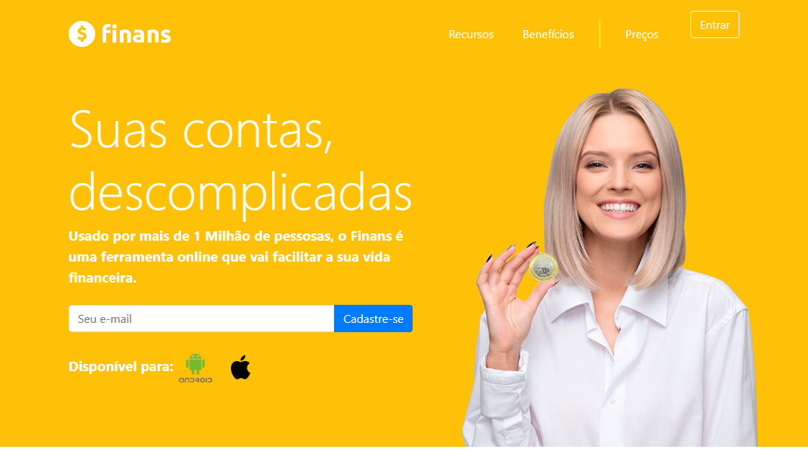

<h2 id="finans">1. Finans: Simplifique Sua Vida Financeira! 💰</h2>

Bem-vindo ao Finans, a ferramenta que vai transformar a forma como você lida com suas finanças! Com uma interface intuitiva e recursos poderosos, o Finans ajuda você a organizar suas contas, economizar e alcançar seus objetivos financeiros.
Comece a organizar suas finanças hoje mesmo! 💰

<h2 id="o-que-o-finans-oferece?">2. 🚀 O Que o Finans Oferece?</h2>

*   **Controle Simplificado:** Acompanhe seus gastos e receitas de forma fácil e intuitiva.
*   **Gráficos e Análises:** Visualize para onde seu dinheiro está indo com gráficos claros e informativos.
*   **Alertas Personalizados:** Receba notificações sobre contas a pagar e receber, evitando atrasos e juros.
*   **Disponível em Diversas Plataformas:** Acesse o Finans no seu computador ou celular, de onde estiver.

<h2 id="como-usar">3. 📱 Como Usar o Finans?</h2>

1.  **Comece Agora:**
    Clique no botão abaixo para iniciar sua jornada com o Finans:

2.  **Explore os Recursos:**
    *   **Categorize seus Lançamentos:** Organize seus gastos e receitas por categorias para melhor visualização.
    *   **Acompanhe seu Orçamento:** Defina metas de gastos e acompanhe seu progresso.
    *   **Configure Alertas:** Defina lembretes para contas a pagar e receber.

3. **Acesse em Diversos Dispositivos:**
    * **O Finans funciona:** no Celular, Tablet ou Desktop.

---
<h2 id="tecnologias-utilizadas">4. ⚙️ Tecnologias Utilizadas</h2>

O Finans foi desenvolvido usando:

*   **HTML5, CSS3, JavaScript:** Para a estrutura, estilo e interatividade.
*   **Bootstrap:** Para um layout responsivo e adaptável a qualquer dispositivo.
*   **Font Awesome:** Para ícones que tornam a interface mais amigável.

<h1 id="codigo-aberto">5. 💻 Código Aberto</h1>

Quer saber como o Finans foi construído? Confira o código-fonte no nosso repositório:

---

<h2 id="como-contribuir">7. 🤝 Como Contribuir</h2>

Siga os passos abaixo para fortalecer este projeto:

| Fase | Ação | Link / Comando |
| :---: | :--- | :--- |
| **01** | **Fork** |  |
| **02** | **Branch** | `git checkout -b feature/MinhaMelhoria` |
| **03** | **Commit** | `git commit -m 'feat: nova seção de álbuns'` |
| **04** | **Push** | `git push origin feature/MinhaMelhoria` |
| **05** | **PR** |  |

---

<h2 id="faq">8. 🧠 Perguntas Frequentes</h2>

**P1:** Como o Finans me ajuda a economizar?

   **R:** Com o Finans, você tem controle total sobre suas finanças, identifica seus maiores gastos e recebe alertas para evitar juros e atrasos.

**P2:** O Finans é seguro?

   **R:** Sim! Utilizamos as melhores práticas de segurança para proteger seus dados.

**P3:** Preciso pagar para usar o Finans?

   **R:** Oferecemos um plano gratuito (simulação) com recursos essenciais e planos pagos com funcionalidades avançadas.

**P4:** Como posso entrar em contato com o desenvolvedor?

   **Resposta:** Você pode entrar em contato através do perfil do GitHub:

---

<h2 id="codigo-fonte">9. 💻 Código Fonte</h2>

Deseja analisar a estrutura do projeto? Explore o repositório oficial:

---

<h2 id="créditos">10. 📝 Créditos & Reconhecimentos</h2> 

| Atribuição | Responsável / Recurso | Descrição |
| :--- | :--- | :--- |
| **Arquitetura & Dev** | **DomisDev** | Idealização, estruturação do código e implementação da lógica responsiva. |
| **Identidade Visual** | **Finans Inc.** | Referência de Design Fictício, paleta de cores e UX (User Experience). |
| **Engine Gráfica** | **Bootstrap & CSS3** | Fornecimento dos componentes de layout e estilização moderna. |
| **Assets Visuais** | **Font Awesome & Devicons** | Ícones de alta fidelidade que compõem a estética da interface. |
| **Aprendizado** | **Comunidade Dev** | Baseado em princípios de Clean Code e boas práticas de Front-end. |

### 🎯 Missão do Projeto
> "Este projeto foi construído com o propósito de demonstrar que interfaces complexas podem ser recriadas com precisão utilizando tecnologias fundamentais da web, servindo de base para estudos de UI/UX e performance."

---

<h2 id="licenca">11. 📄 Licença</h2>

Este projeto está licenciado sob a 

---

<h2 id="perfil-do-github">12. 👨‍💻 Perfil do GitHub</h2>

