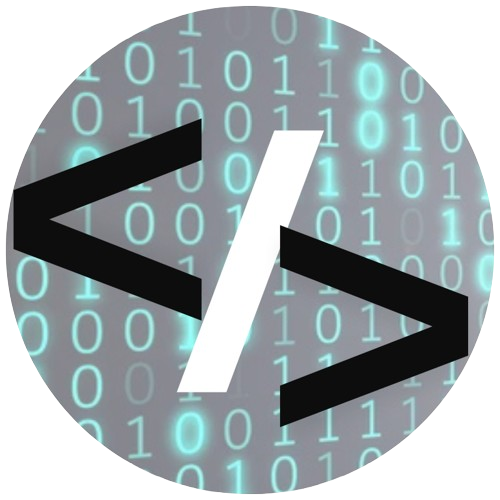

# 💰 Finans: Simplifique Sua Vida Financeira! 💰

Bem-vindo ao Finans, a ferramenta que vai transformar a forma como você lida com suas finanças! Com uma interface intuitiva e recursos poderosos, o Finans ajuda você a organizar suas contas, economizar e alcançar seus objetivos financeiros.

## 🚀 O Que o Finans Oferece?

*   **Controle Simplificado:** Acompanhe seus gastos e receitas de forma fácil e intuitiva.
*   **Gráficos e Análises:** Visualize para onde seu dinheiro está indo com gráficos claros e informativos.
*   **Alertas Personalizados:** Receba notificações sobre contas a pagar e receber, evitando atrasos e juros.
*   **Disponível em Diversas Plataformas:** Acesse o Finans no seu computador ou celular, de onde estiver.

## 📱 Como Usar o Finans?

1.  **Comece Agora:**
    Clique no botão abaixo para iniciar sua jornada com o Finans:

2.  **Explore os Recursos:**
    *   **Categorize seus Lançamentos:** Organize seus gastos e receitas por categorias para melhor visualização.
    *   **Acompanhe seu Orçamento:** Defina metas de gastos e acompanhe seu progresso.
    *   **Configure Alertas:** Defina lembretes para contas a pagar e receber.

3. **Acesse em Diversos Dispositivos:**
    * **O Finans funciona:** no Celular, Tablet ou Desktop.

---
## ⚙️ Tecnologias Utilizadas

O Finans foi desenvolvido usando:

*   **HTML5, CSS3, JavaScript:** Para a estrutura, estilo e interatividade.
*   **Bootstrap:** Para um layout responsivo e adaptável a qualquer dispositivo.
*   **Font Awesome:** Para ícones que tornam a interface mais amigável.

## 💻 Código Aberto

Quer saber como o Finans foi construído? Confira o código-fonte no nosso repositório:

[Repositório do Finans](https://domisnnet.github.io/finans/)

---

## 📝 Licença:

Este projeto está licenciado sob a [MIT License](LICENSE).

---

## 🤝 Contribuição:

    

       👠 Siga os passos para fortalecer este deck:
    

    <ul style="list-style-type: none; padding: 0; margin: 0;">
      <li style="margin-bottom: 10px;">
           1. 🴠<a href="https://github.com/Domisnnet/finans/fork" target="_blank" style="color: #1c7430; text-decoration: underline;">Faça um fork</a>: Adicione este projeto ao seu deck.
      </li>
      <li style="margin-bottom: 10px;">
          2. 🌿 Crie uma branch: Prepare suas atualizações. <a href="https://www.atlassian.com/br/git/tutorials/using-branches" target="_blank" style="color: #1c7430; text-decoration: underline;">Tutorial sobre Branches</a>
      </li>
      <li style="margin-bottom: 10px;">
          3. ✍️ Prepare seus commits: Guarde suas mudanças. <a href="https://www.atlassian.com/br/git/tutorials/saving-changes/git-commit" target="_blank" style="color: #1c7430; text-decoration: underline;">Tutorial sobre Commits</a>
      </li>
     <li style="margin-bottom: 10px;">
          4. 🚀 Envie: Lance sua sugestão (`git push origin minha-contribuicao`).
      </li>
      <li>
           5. ⚔️ <a href="https://github.com/Domisnnet/finans/compare" target="_blank" style="color: #1c7430; text-decoration: underline;">Abra um Pull Request</a>: Desafie este deck original.
      </li>
      <li>
           6. 🛠<a href="https://github.com/Domisnnet/finans/issues" target="_blank" style="color: #1c7430; text-decoration: underline;">Reportar um problema/Sugestão (Issues)</a>
      </li>
    </ul>

---

## 📝 Créditos

*   **Desenvolvedor:** __DomisDev.__

*   **Design:** Layout e elementos visuais criados para uma experiência intuitiva.
*   **Estilização:** Bootstrap e CSS personalizados.

## 🤔 Perguntas Frequentes (FAQ)

**P1:** Como o Finans me ajuda a economizar?

   **R:** Com o Finans, você tem controle total sobre suas finanças, identifica seus maiores gastos e recebe alertas para evitar juros e atrasos.

**P2:** O Finans é seguro?

   **R:** Sim! Utilizamos as melhores práticas de segurança para proteger seus dados.

**P3:** Preciso pagar para usar o Finans?

   **R:** Oferecemos um plano gratuito (simulação) com recursos essenciais e planos pagos com funcionalidades avançadas.

**P4:** Como posso entrar em contato com o desenvolvedor?

   **Resposta:** Você pode entrar em contato através do perfil do GitHub: 

<a href="https://github.com/Domisnnet">
    
    DomisDev
</a> 

---

Comece a organizar suas finanças hoje mesmo! 💰